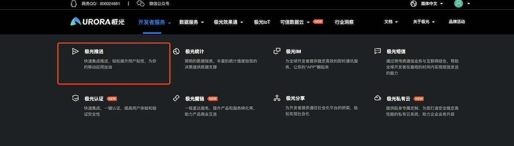
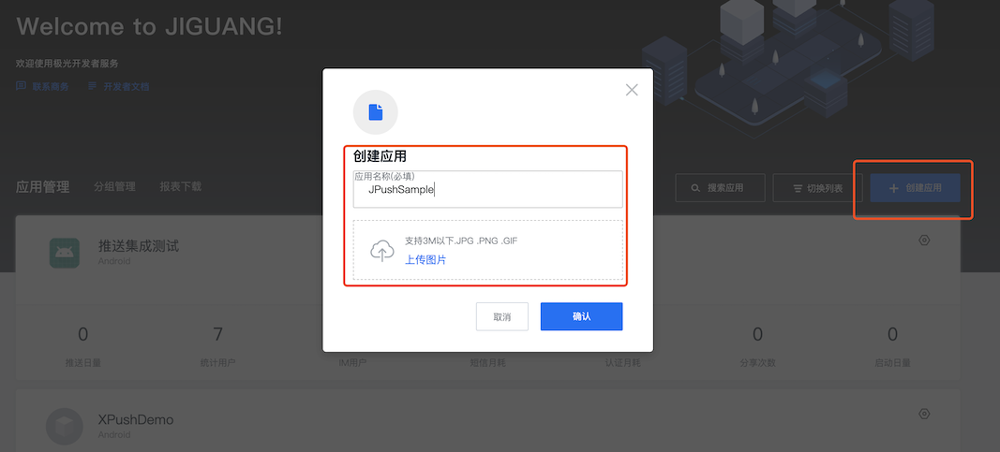
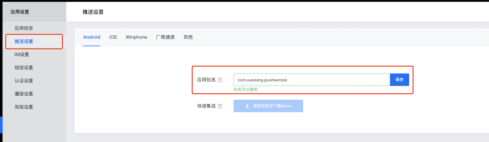
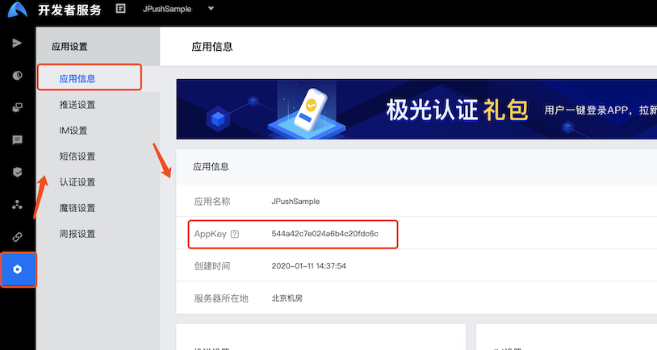

## 极光推送准备工作-获取AppKey

> 在接入极光推送前，首先需要获取到应用的AppKey，它是应用的唯一标识。

### 创建极光推送开发者帐号

要创建极光推送开发者帐号，请访问极光推送官方网站: https://www.jiguang.cn/push

### 创建应用

进入极光控制台后，点击“创建应用”按钮，填写应用名称即可创建应用成功。同时点击“推送设置”，在 Android 版块填上你的应用包名，选择保存即可。

### 获取APPKEY

在极光控制台点击"应用设置"中的"应用信息"，获取应用的AppKey。

