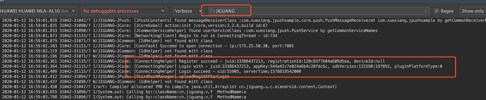
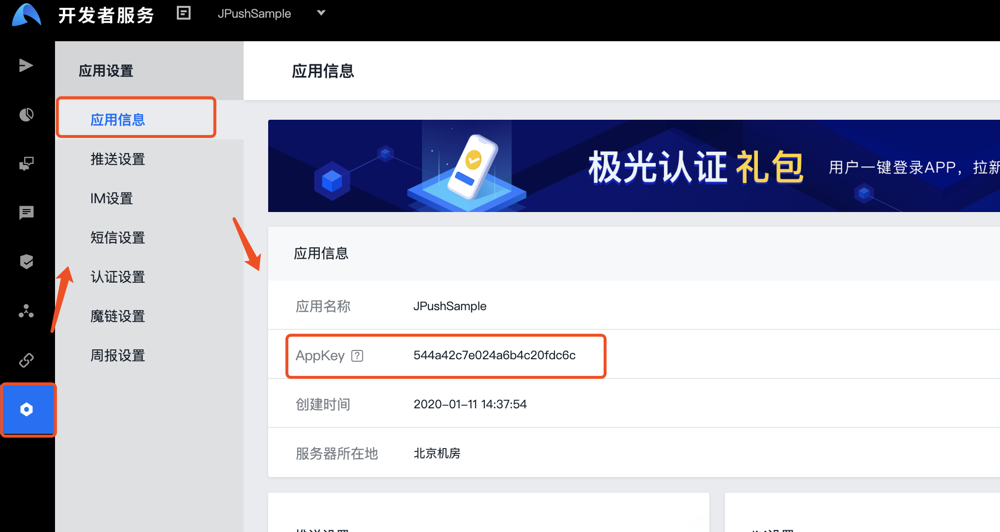

# JPushSample

极光推送Android客户端使用指南，极光推送官网: https://www.jiguang.cn/push

## 关于我

[](https://github.com/xuexiangjys)   [](http://blog.csdn.net/xuexiangjys)   [](https://www.jianshu.com/u/6bf605575337)   [](https://juejin.im/user/598feef55188257d592e56ed)   [](https://www.zhihu.com/people/xuexiangjys)

---

## 前言

极光推送是国内最早做第三方消息推送平台的公司，在消息推送界还是相对有影响力的。我最早是在2016年接触到极光消息推送的，那时候公司需要做消息推送业务，但是由于之前没做过消息推送，且自建消息推送平台代价太高，而且稳不稳定谁也不敢打包票，于是就选择了当时较为有名的极光推送。

那么当时我为什么选择极光推送呢？

* 1.免费。免费版本的每个 Appkey 的最高推送频率为 600 次/分钟，而且没有推送数量限制，者对于消息推送业务刚起步的企业来说，完全够用了。

* 2.上手简单，文档齐全。平台官网上的文档非常详细，下载下来的演示demo也非常丰富，通过简单的几行代码就可以轻松接入。

* 3.功能丰富。比起小米推送、华为推送、信鸽推送、友盟推送来说，极光推送的功能是最全的。想具体了解这几种推送的可参见我的开源框架[XPush](https://github.com/xuexiangjys/XPush).

* 4.社区支持度高。就拿我们Android来说，不仅支持原生集成，还支持React Native、Flutter、Weex、HBuilder、Cordova等混合开发方式。

那么极光推送真的有那么好吗？其实也不全是，我在使用的过程中也发现了一些问题：

* 1.推送的到达率差一点。只要应用退到后台被系统回收或者被用户杀死，基本就很难再收到推送了。这点自然比不上那些手机厂商的推送。

* 2.没有免费开放厂商通道推送集成。想要集成厂商通道推送的话，还需要充钱成为VIP才行。

不过如果你是消息推送的初学者的话，我想极光推送肯定是你不二的选择。那么下面来跟着我学习如何使用极光推送吧！

---

## 快速集成指南

> 本文是基于`jpush:3.5.4`和`jcore:2.2.6`版本介绍的，暂只介绍最新推荐的使用方法，那些过时的用法这里我就不多介绍了，想了解的可以去[极光推送官方文档](https://docs.jiguang.cn/jpush/client/Android/android_sdk/)查看。

### 集成前的准备工作

> 在接入极光推送前，首先需要获取到应用的AppKey，它是应用的唯一标识。

1.创建极光推送开发者帐号

要创建极光推送开发者帐号，请访问极光推送官方网站: https://www.jiguang.cn/push


2.创建应用

进入极光控制台后，点击“创建应用”按钮，填写应用名称即可创建应用成功。同时点击“推送设置”，在 Android 版块填上你的应用包名，选择保存即可。


3.获取应用的AppKey

在极光控制台点击"应用设置"中的"应用信息"，获取应用的AppKey。


### 引入依赖库

#### 方法一 jcenter自动集成

> 使用 jcenter 自动集成的开发者，不需要在项目中添加 jar 和 so，jcenter 会自动完成依赖；在 AndroidManifest.xml 中不需要添加任何 JPush SDK 相关的配置，jcenter 会自动导入。

1.配置项目的`build.gradle`文件

```
android {

    defaultConfig {
        applicationId "com.xxx.xxx" //JPush平台上注册的应用包名.

        ...

        ndk {
            //选择要添加的对应 cpu 类型的 .so 库。
            abiFilters 'armeabi', 'armeabi-v7a', 'arm64-v8a'
            //,'x86', 'x86_64', 'mips', 'mips64'
        }
        manifestPlaceholders = [
                JPUSH_PKGNAME: defaultConfig.applicationId,
                JPUSH_APPKEY : "你的 Appkey ",//值来自开发者平台取得的AppKey
                JPUSH_CHANNEL: "default_developer",
        ]
    }

}

dependencies {
    ...
    //引入JPush依赖库
    implementation 'cn.jiguang.sdk:jpush:3.5.4'
    implementation 'cn.jiguang.sdk:jcore:2.2.6'
}
```

2.配置项目的`AndroidManifest.xml`文件

```
<manifest xmlns:android="http://schemas.android.com/apk/res/android"
    package="com.xuexiang.jpush">

    <application>

        <!-- 1.这个是自定义Service，要继承极光JCommonService，可以在更多手机平台上使得推送通道保持的更稳定 -->
        <service
            android:name=".PushService"
            android:enabled="true"
            android:exported="false"
            android:process=":pushcore">
            <intent-filter>
                <action android:name="cn.jiguang.user.service.action" />
            </intent-filter>
        </service>

        <!-- 2.用户自定义接收消息器,所有你想要知道的消息都在这里-->
        <receiver android:name=".core.push.PushMessageReceiver">
            <intent-filter>
                <action android:name="cn.jpush.android.intent.RECEIVE_MESSAGE" />
                <category android:name="${applicationId}" />
            </intent-filter>
        </receiver>

    </application>

</manifest>
```

[点击参见自动集成的项目源码](https://github.com/xuexiangjys/JPushSample/tree/master/jpush-remote)


#### 方法二 本地手动集成

1.首先你需要先去下载SDK，下载地址: https://docs.jiguang.cn/jpush/resources/

2.解压SDK，将压缩包下的libs内容复制到项目的libs下

3.配置项目的`build.gradle`文件

```
android {

    defaultConfig {
        applicationId "com.xxx.xxx" //JPush平台上注册的应用包名.

        ...

        ndk {
            //选择要添加的对应 cpu 类型的 .so 库。
            abiFilters 'armeabi', 'armeabi-v7a', 'arm64-v8a'
            //,'x86', 'x86_64', 'mips', 'mips64'
        }
        manifestPlaceholders = [
                JPUSH_PKGNAME: defaultConfig.applicationId,
                JPUSH_APPKEY : "你的 Appkey ",//值来自开发者平台取得的AppKey
                JPUSH_CHANNEL: "default_developer",
        ]
    }

    sourceSets {
        //设置libs目录为so包的加载目录
        main {
            jniLibs.srcDirs = ['libs']
        }
    }

}
```

4.配置项目的`AndroidManifest.xml`文件

```
<manifest xmlns:android="http://schemas.android.com/apk/res/android"
    xmlns:tools="http://schemas.android.com/tools"
    package="com.xxx.xxx">

    <permission
        android:name="${applicationId}.permission.JPUSH_MESSAGE"
        android:protectionLevel="signature" />

    <!-- Required  一些系统要求的权限，如访问网络等-->
    <uses-permission android:name="${applicationId}.permission.JPUSH_MESSAGE" />
    <uses-permission android:name="android.permission.RECEIVE_USER_PRESENT" />
    <uses-permission android:name="android.permission.INTERNET" />
    <uses-permission android:name="android.permission.WAKE_LOCK" />
    <uses-permission android:name="android.permission.READ_PHONE_STATE" />
    <uses-permission android:name="android.permission.WRITE_EXTERNAL_STORAGE" />
    <uses-permission android:name="android.permission.READ_EXTERNAL_STORAGE" />
    <uses-permission android:name="android.permission.WRITE_SETTINGS" />
    <uses-permission android:name="android.permission.VIBRATE" />
    <uses-permission android:name="android.permission.MOUNT_UNMOUNT_FILESYSTEMS" />
    <uses-permission android:name="android.permission.ACCESS_NETWORK_STATE" />
    <uses-permission android:name="android.permission.ACCESS_WIFI_STATE" />

    <!-- 用于开启 debug 版本的应用在6.0 系统上 层叠窗口权限 -->
    <uses-permission android:name="android.permission.SYSTEM_ALERT_WINDOW" />
    <!-- Optional for location -->
    <uses-permission android:name="android.permission.ACCESS_COARSE_LOCATION" />
    <uses-permission android:name="android.permission.CHANGE_WIFI_STATE" />
    <uses-permission android:name="android.permission.ACCESS_FINE_LOCATION" />
    <uses-permission android:name="android.permission.ACCESS_LOCATION_EXTRA_COMMANDS" />
    <uses-permission android:name="android.permission.CHANGE_NETWORK_STATE" />
    <uses-permission android:name="android.permission.GET_TASKS" />

    <application>
        <!-- Required SDK核心功能-->
        <activity
            android:name="cn.jpush.android.ui.PushActivity"
            android:configChanges="orientation|keyboardHidden"
            android:exported="false"
            android:theme="@android:style/Theme.NoTitleBar">
            <intent-filter>
                <action android:name="cn.jpush.android.ui.PushActivity" />

                <category android:name="android.intent.category.DEFAULT" />
                <category android:name="${applicationId}" />
            </intent-filter>
        </activity>
        <!-- Required SDK 核心功能-->
        <!-- 可配置android:process参数将PushService放在其他进程中 -->
        <service
            android:name="cn.jpush.android.service.PushService"
            android:exported="false"
            android:process=":pushcore">
            <intent-filter>
                <action android:name="cn.jpush.android.intent.REGISTER" />
                <action android:name="cn.jpush.android.intent.REPORT" />
                <action android:name="cn.jpush.android.intent.PushService" />
                <action android:name="cn.jpush.android.intent.PUSH_TIME" />
            </intent-filter>
        </service>
        <!-- since 3.0.9 Required SDK 核心功能-->
        <provider
            android:name="cn.jpush.android.service.DataProvider"
            android:authorities="${applicationId}.DataProvider"
            android:exported="false" />
        <!-- since 1.8.0 option 可选项。用于同一设备中不同应用的JPush服务相互拉起的功能。 -->
        <!-- 若不启用该功能可删除该组件，将不拉起其他应用也不能被其他应用拉起 -->
        <service
            android:name="cn.jpush.android.service.DaemonService"
            android:enabled="true"
            android:exported="true">
            <intent-filter>
                <action android:name="cn.jpush.android.intent.DaemonService" />
                <category android:name="${applicationId}" />
            </intent-filter>
        </service>
        <!-- since 3.1.0 Required SDK 核心功能-->
        <provider
            android:name="cn.jpush.android.service.DownloadProvider"
            android:authorities="${applicationId}.DownloadProvider"
            android:exported="true" />
        <!-- Required SDK核心功能-->
        <receiver
            android:name="cn.jpush.android.service.PushReceiver"
            android:enabled="true"
            android:exported="false">
            <intent-filter android:priority="1000">
                <!--Required  显示通知栏 -->
                <action android:name="cn.jpush.android.intent.NOTIFICATION_RECEIVED_PROXY" />
                <category android:name="${applicationId}" />
            </intent-filter>
            <intent-filter>
                <action android:name="android.intent.action.USER_PRESENT" />
                <action android:name="android.net.conn.CONNECTIVITY_CHANGE" />
            </intent-filter>
            <!-- Optional -->
            <intent-filter>
                <action android:name="android.intent.action.PACKAGE_ADDED" />
                <action android:name="android.intent.action.PACKAGE_REMOVED" />

                <data android:scheme="package" />
            </intent-filter>
        </receiver>

        <!-- Required SDK核心功能-->
        <receiver
            android:name="cn.jpush.android.service.AlarmReceiver"
            android:exported="false" />

        <!--since 3.3.0 Required SDK核心功能-->
        <activity
            android:name="cn.jpush.android.service.JNotifyActivity"
            android:exported="true"
            android:taskAffinity="jpush.custom"
            android:theme="@android:style/Theme.Translucent.NoTitleBar">
            <intent-filter>
                <action android:name="cn.jpush.android.intent.JNotifyActivity" />
                <category android:name="${applicationId}" />
            </intent-filter>
        </activity>


        <!-- *********************下面这两个是需要你自己定义的**************************** -->


        <!-- since 3.3.0 Required SDK 核心功能-->
        <!-- 1.这个是自定义Service，要继承极光JCommonService，可以在更多手机平台上使得推送通道保持的更稳定 -->
        <service
            android:name=".PushService"
            android:enabled="true"
            android:exported="false"
            android:process=":pushcore">
            <intent-filter>
                <action android:name="cn.jiguang.user.service.action" />
            </intent-filter>
        </service>

        <!-- 2.用户自定义接收消息器,所有你想要知道的消息都在这里-->
        <receiver android:name=".core.push.PushMessageReceiver">
            <intent-filter>
                <action android:name="cn.jpush.android.intent.RECEIVE_MESSAGE" />
                <category android:name="${applicationId}" />
            </intent-filter>
        </receiver>


        <meta-data
            android:name="JPUSH_CHANNEL"
            android:value="${JPUSH_CHANNEL}" />
        <!-- 值来自开发者平台取得的AppKey-->
        <meta-data
            android:name="JPUSH_APPKEY"
            android:value="${JPUSH_APPKEY}" />

    </application>

</manifest>

```

[点击参见手动集成的项目源码](https://github.com/xuexiangjys/JPushSample/tree/master/jpush-local)

### 初始化

1.在Application中初始化JPush

```
public class MyApp extends Application {
@Override
    public void onCreate() {
        super.onCreate();
        initJPush();
    }
}

/**
 * 初始化极光推送
 */
private void initJPush() {
    JPushInterface.setDebugMode(BuildConfig.DEBUG);
    //只需要在应用程序启动时调用一次该 API 即可
    JPushInterface.init(this);
}
```

2.在应用的第一个页面申请权限（可选）

由于Android手机定制ROM太多，部分手机的通知栏权限默认是关闭的，需要用户手动打开。如果不打开通知栏权限的话，即使你连上了推送，也无法收到推送消息。

```
/**
 * 申请定位、存储和通知栏的权限
 *
 * @param activity
 */
public static void requestPermission(Activity activity) {
    //打开通知栏的权限
    if (JPushInterface.isNotificationEnabled(activity) == 0) {
        new AlertDialog.Builder(activity)
                .setCancelable(false)
                .setMessage("通知权限未打开，是否前去打开？")
                .setPositiveButton("是", (d, w) -> JPushInterface.goToAppNotificationSettings(activity))
                .setNegativeButton("否", null)
                .show();
    }
    //申请定位、存储权限
    JPushInterface.requestPermission(activity);
}
```


### 运行调试

当完成以上步骤后，可直接运行程序，并查看logcat日志，设置过滤条件为"JIGUANG"，如果出现"Register succeed"和"registrationId:xxxxxxxxxxxxxx"字样，即为集成成功！如下图所示：



注意事项：

* 一定要保证配置的AppKey和应用的包名保持一致。
* 一定要保证运行的设备网络是可用的，否则无法连接推送。

### 混淆配置

配置项目的`proguard-rules.pro`文件。

```
-dontoptimize
-dontpreverify
-dontwarn cn.jpush.**
-keep class cn.jpush.** { *; }
-dontwarn cn.jiguang.**
-keep class cn.jiguang.** { *; }
-keep class cn.jiguang.** { *; }
-keep class * extends cn.jpush.android.service.JPushMessageReceiver{*;}
```

----

## 基础功能使用

### 初始化

1.上面已经讲过了，推送初始化建议在自定义的 Application 中的 onCreate 中调用，且推送初始化只需要调用一次即可。

```
JPushInterface.init(Context context);
```

2.推送初始化成功后，平台会返回一个唯一的token令牌，那就是`RegistrationID`，获取它的方法如下：

```
JPushInterface.getRegistrationID(Context context);
```

3.获取当前推送的连接状态方法如下：

```
JPushInterface.getConnectionState(Context context)
```

[点击参见推送初始化演示源码](https://github.com/xuexiangjys/JPushSample/blob/master/app/src/main/java/com/xuexiang/jpushsample/fragment/PushInitFragment.java)


### 推送状态控制

1.停止推送。在某些业务中，我们需要临时暂停推送，例如账户退出登陆等，这个时候我们可以调用如下方法：

```
JPushInterface.stopPush(Context context);
```

需要注意的是，这里的停止推送只是个本地客户端的操作，并不会通知到推送服务平台。其表现效果类似设备断网，将不会收到任何推送消息，并且极光推送所有的其他 API 调用都无效，除了`resumePush`恢复推送服务的方法。

2.恢复推送。当调用了停止推送的方法后，只有调用恢复推送的方法后，极光推送服务才能正常工作。方法如下：

```
JPushInterface.resumePush(Context context);
```

3.获取推送的工作状态。想要知道当前推送服务是否正在工作，可通过如下方法：

```
JPushInterface.isPushStopped(Context context);
```

[点击参见推送状态控制演示源码](https://github.com/xuexiangjys/JPushSample/blob/master/app/src/main/java/com/xuexiang/jpushsample/fragment/PushInitFragment.java)


-------


### 操作别名alias

> 别名在极光推送中尤为重要，通常我们用得最多的就是根据别名进行推送。我们通常的做法是用户登陆后，业务平台会返回一个平台生成的唯一识别号作为推送的别名，然后后台需要推送的时候，就直接拿着这个别名通知极光推送服务进行消息推送。

1.绑定别名alias。

```
JPushInterface.setAlias(Context context, int sequence, String alias);
```

2.解绑别名alias。

```
JPushInterface.deleteAlias(Context context, int sequence);
```

3.获取绑定的别名alias。

```
JPushInterface.getAlias(Context context, int sequence);
```

注意事项：

1.这里的`sequence`主要就是操作识别码，用于识别操作类型，由使用者自己定义。

2.以上所有的方法返回的都是void（都是异步操作），方法的返回都在自定义的消息接收器中，就是上面继承JPushMessageReceiver由使用者自定义的广播接收器中获取。

3.别名相关操作的结果都在`JPushMessageReceiver`的`onAliasOperatorResult`方法中回调，需要获取别名操作结果的可重写该方法。

[点击参见别名操作演示源码](https://github.com/xuexiangjys/JPushSample/blob/master/app/src/main/java/com/xuexiang/jpushsample/fragment/AliasAndTagsOperationFragment.java)


### 操作标签Tags

> 标签好比一个分组，当我们需要对某一类特殊群体进行消息推送时，便可使用标签进行推送。

1.增加标签Tags。这是一个增量请求。

```
JPushInterface.addTags(Context context, int sequence, Set<String> tags);
```

2.删除标签Tags。

```
JPushInterface.deleteTags(Context context, int sequence, Set<String> tags);
```

3.获取标签Tags。

```
JPushInterface.getAllTags(Context context, int sequence);
```

4.设置标签Tags。这是一个全量请求，会覆盖之前设置的标签。

```
JPushInterface.setTags(Context context, int sequence, Set<String> tags);
```

5.清除所有标签。

```
JPushInterface.cleanTags(Context context, int sequence);
```

6.查询指定 tag 与当前用户绑定的状态。

```
JPushInterface.checkTagBindState(Context context, int sequence, String tag);
```

注意事项：

1.这里的`sequence`和别名方法中的一样，也是操作识别码，用于识别操作类型，由使用者自己定义。

2.以上所有的方法返回的都是void（都是异步操作），方法的返回都在自定义的消息接收器中，就是上面继承JPushMessageReceiver由使用者自定义的广播接收器中获取。

3.标签相关操作的结果都在`JPushMessageReceiver`的`onTagOperatorResult`方法中回调，需要获取标签操作结果的可重写该方法。

4.`checkTagBindState`方法的结果是在`JPushMessageReceiver`的`onCheckTagOperatorResult`方法中回调，需要获取标签查询匹配结果的可重写该方法。

[点击参见标签操作演示源码](https://github.com/xuexiangjys/JPushSample/blob/master/app/src/main/java/com/xuexiang/jpushsample/fragment/AliasAndTagsOperationFragment.java)


-------

### 操作结果获取

> 这里的操作主要包括：注册、别名(绑定、解绑、获取)、标签(添加、删除、获取、设置、清除、状态检查)、手机号设置等。由于极光提供的这些操作都是异步的，且方法不能直接返回结果和提供回调接口，因此只能通过重写`JPushMessageReceiver`中相应的方法获取。

所有的操作结果都可以从`JPushMessageReceiver`提供的回调方法中获取。但是`JPushMessageReceiver`最多只能作为消息的中转站，使用起来极为不便，因此我们可以结合一些事件机制来处理，将这些结果包装为一个个推送事件向外发出去，这样只需要在需要的地方订阅一下事件就可以获取到结果了。下面我以RxBus为例简单编写，使用的库是我的开源库[RxUtil2](https://github.com/xuexiangjys/RxUtil2)

1.定义操作事件的类型,用于识别操作类型。上文中提到的`sequence`参数就可以使用它。

```
/**
 * 推送事件的类型
 */
@IntDef({TYPE_REGISTER, TYPE_UNREGISTER, TYPE_CONNECT_STATUS_CHANGED, TYPE_ADD_TAGS, TYPE_DEL_TAGS, TYPE_GET_TAGS, TYPE_BIND_ALIAS, TYPE_UNBIND_ALIAS, TYPE_GET_ALIAS})
@Retention(RetentionPolicy.SOURCE)
public @interface EventType {
    /**
     * 注册推送
     */
    int TYPE_REGISTER = 2000;
    /**
     * 取消注册推送
     */
    int TYPE_UNREGISTER = 2001;
    /**
     * 推送连接状态发生变化
     */
    int TYPE_CONNECT_STATUS_CHANGED = 2002;

    /**
     * 绑定别名
     */
    int TYPE_BIND_ALIAS = 2010;
    /**
     * 解绑别名
     */
    int TYPE_UNBIND_ALIAS = 2011;
    /**
     * 获取别名
     */
    int TYPE_GET_ALIAS = 2012;

    /**
     * 添加标签[增量]
     */
    int TYPE_ADD_TAGS = 2020;
    /**
     * 删除标签
     */
    int TYPE_DEL_TAGS = 2021;
    /**
     * 获取标签
     */
    int TYPE_GET_TAGS = 2022;
    /**
     * 设置标签[全量]
     */
    int TYPE_SET_TAGS = 2023;
    /**
     * 清除所有标签
     */
    int TYPE_CLEAN_TAGS = 2024;
    /**
     * 查询指定 tag 与当前用户绑定的状态
     */
    int TYPE_CHECK_TAG_BIND_STATE = 2025;
}
```

2.定义推送事件的载体.

该载体只需要定义三个成员变量：mType（事件类型）、mIsSuccess（是否成功）、mData（携带的数据）。如下所示：

```
/**
 * 推送事件的载体
 */
public final class PushEvent {
    public static final String KEY_PUSH_EVENT = "com.xuexiang.jpushsample.core.push.event.KEY_PUSH_EVENT";
    /**
     * 事件类型
     */
    private int mType;
    /**
     * 是否成功（也可以定义为int型的结果码）
     */
    private boolean mIsSuccess;
    /**
     * 携带的数据（也可以定义为String型的数据）
     */
    private Object mData;

    public PushEvent(@EventType int type) {
        mType = type;
    }

    public PushEvent(@EventType int type, boolean isSuccess) {
        mType = type;
        mIsSuccess = isSuccess;
    }

    public PushEvent(@EventType int type, Object data) {
        mType = type;
        mData = data;
    }

    public int getType() {
        return mType;
    }

    public PushEvent setType(@EventType int type) {
        mType = type;
        return this;
    }

    public boolean isSuccess() {
        return mIsSuccess;
    }

    public PushEvent setSuccess(boolean success) {
        mIsSuccess = success;
        return this;
    }

    public Object getData() {
        return mData;
    }

    public PushEvent setData(Object data) {
        mData = data;
        return this;
    }
}
```

3.事件处理并发送.

在`JPushMessageReceiver`中重写指定的方法，并将结果转译为一个个`PushEvent`发送出去。

```
/**
 * 极光推送消息接收器
 */
public class PushMessageReceiver extends JPushMessageReceiver {
    private static final String TAG = "JPush-Receiver";
    //======================下面的都是操作的回调=========================================//

    @Override
    public void onRegister(Context context, String registrationId) {
        Log.e(TAG, "[onRegister]:" + registrationId);
        RxBusUtils.get().post(KEY_PUSH_EVENT, new PushEvent(EventType.TYPE_REGISTER, true, registrationId));
    }

    /**
     * 连接状态发生变化
     *
     * @param context
     * @param isConnected 是否已连接
     */
    @Override
    public void onConnected(Context context, boolean isConnected) {
        Log.e(TAG, "[onConnected]:" + isConnected);
        RxBusUtils.get().post(KEY_PUSH_EVENT, new PushEvent(EventType.TYPE_CONNECT_STATUS_CHANGED, isConnected));
    }

    /**
     * 所有和标签相关操作结果
     *
     * @param context
     * @param jPushMessage
     */
    @Override
    public void onTagOperatorResult(Context context, JPushMessage jPushMessage) {
        Log.e(TAG, "[onTagOperatorResult]:" + jPushMessage);
        PushEvent pushEvent = new PushEvent(jPushMessage.getSequence(), jPushMessage.getErrorCode() == 0)
                .setData(JPushInterface.getStringTags(jPushMessage.getTags()));
        RxBusUtils.get().post(KEY_PUSH_EVENT, pushEvent);
    }

    /**
     * 所有和别名相关操作结果
     *
     * @param context
     * @param jPushMessage
     */
    @Override
    public void onAliasOperatorResult(Context context, JPushMessage jPushMessage) {
        Log.e(TAG, "[onAliasOperatorResult]:" + jPushMessage);
        PushEvent pushEvent = new PushEvent(jPushMessage.getSequence(), jPushMessage.getErrorCode() == 0)
                .setData(jPushMessage.getAlias());
        RxBusUtils.get().post(KEY_PUSH_EVENT, pushEvent);
    }

    /**
     * 标签状态检测结果
     *
     * @param context
     * @param jPushMessage
     */
    @Override
    public void onCheckTagOperatorResult(Context context, JPushMessage jPushMessage) {
        Log.e(TAG, "[onCheckTagOperatorResult]:" + jPushMessage);
        PushEvent pushEvent = new PushEvent(jPushMessage.getSequence(), jPushMessage.getErrorCode() == 0)
                .setData(jPushMessage);
        RxBusUtils.get().post(KEY_PUSH_EVENT, pushEvent);
    }
}
```

4.在需要获取结果的地方订阅或者取消事件。

```
    @Override
    protected void initListeners() {
        //订阅推送事件
        mPushEvent = RxBusUtils.get().onMainThread(KEY_PUSH_EVENT, PushEvent.class, this::handlePushEvent);
    }
    
   /**
     * 处理推送事件，获取操作的结果
     * @param pushEvent
     */
    private void handlePushEvent(PushEvent pushEvent) {
        String content = pushEvent.getData().toString();
        switch (pushEvent.getType()) {
            case TYPE_BIND_ALIAS:
                if (pushEvent.isSuccess()) {
                    tvAlias.setText(content);
                    XToastUtils.success("别名[" + content + "]绑定成功");
                } else {
                    XToastUtils.error("别名[" + content + "]绑定失败");
                }
                break;
            case TYPE_UNBIND_ALIAS:
                //别名解绑
                break;
            case TYPE_GET_ALIAS:
                //获取别名
                break;
            case TYPE_ADD_TAGS:
                //添加标签
                break;
            case TYPE_DEL_TAGS:
                //删除标签
                break;
            case TYPE_GET_TAGS:
                //获取标签
                break;
            case TYPE_SET_TAGS:
                //设置标签
                break;
            case TYPE_CLEAN_TAGS:
                //清除标签
                break;
            case TYPE_CHECK_TAG_BIND_STATE:
                //检查标签
                break;
                ........
            default:
                break;
        }
    }
    
    @Override
    public void onDestroyView() {
        if (mPushEvent != null) {
            //取消订阅推送事件
            RxBusUtils.get().unregister(KEY_PUSH_EVENT, mPushEvent);
            mPushEvent = null;
        }
        super.onDestroyView();
    }
```

[点击参见操作结果获取演示源码](https://github.com/xuexiangjys/JPushSample/tree/master/app/src/main/java/com/xuexiang/jpushsample/core/push)

[点击参见自定义JPushMessageReceiver的源码](https://github.com/xuexiangjys/JPushSample/blob/master/app/src/main/java/com/xuexiang/jpushsample/core/push/PushMessageReceiver.java)

-------

### 消息接收

#### 自定义消息

> 自定义消息，又称之为透传消息。顾名思义是由使用者自己定义一套解析格式的消息，这种消息在接收到后不会有任何界面上的展示，携带内容为String型，通常的做法是传一个json。这种比较灵活的消息推送方式是最常用的一种。但是这里需要注意的是，这种消息是一种应用内的消息，一旦应用被杀死，将无法及时收到该消息。

1.自定义消息体(CustomMessage)介绍

字段名 | 类型 | 字段说明 
:-|:-:|:-
messageId | String | 消息ID，对应推送平台上的消息唯一号
message | String | 对应推送消息界面上的“自定义消息内容”字段
extra | String | 保存服务器推送下来的附加字段。这是个 JSON 字符串，对应推送消息界面上的“可选设置”里的附加字段。
title | String | 消息的标题（没多大作用）

2.自定义消息接收

如果想要接收自定义消息，只需重写`JPushMessageReceiver`中的`onMessage`方法即可。在`onMessage`方法中将会回调`CustomMessage`自定义消息体。


#### 普通通知消息

> 普通通知消息，就是在系统通知栏上显示的消息。但是如果通知的内容为空，则不会在通知栏上展示通知。

1.通知消息体(NotificationMessage)介绍

字段名 | 类型 | 字段说明 
:-|:-:|:-
messageId | String | 消息ID，对应推送平台上的消息唯一号
notificationId | int | 通知栏的 Notification ID，用于清除 Notification
notificationTitle | String | 通知的标题，对应推送通知界面上的“通知标题”字段
notificationContent | String | 通知的内容，对应推送通知界面上的“通知内容”字段
notificationExtras | String | 附加字段，对应推送通知界面上的“可选设置”里的附加字段
notificationTitle | String | 通知的标题，对应推送通知界面上的“通知标题”字段

2.普通通知消息接收

如果想要接收自定义消息，只需重写`JPushMessageReceiver`中的`onNotifyMessageArrived`方法即可。在`onNotifyMessageArrived`方法中将会回调`NotificationMessage`通知消息体。

3.通知消息被点击

> 在做消息推送开发的时候，我们一定会有一个需求：希望用户点击通知后，能够自动跳转到我们应用的某个页面。这个页面可能是某一个活动宣传页面，也有可能是某个新闻或者视频页面。这个时候，我们就需要对通知消息点击后的动作进行自定义。

那么我们该如何自定义通知消息被点击后的动作呢？很简单，我们只需要重写`JPushMessageReceiver`中的`onNotifyMessageOpened`方法，在方法中读取传递过来的参数，然后结合页面路由机制（例如：ARouter）直接跳转至指定页面即可。

下面我将通过两种不同的途径来实现 点击通知消息后跳转至某一特定界面：

1.重写`JPushMessageReceiver`中的`onNotifyMessageOpened`方法。

```
public class PushMessageReceiver extends JPushMessageReceiver {
    /**
     * 点击通知回调
     *
     * @param context
     * @param message 通知消息
     */
    @Override
    public void onNotifyMessageOpened(Context context, NotificationMessage message) {
        Log.e(TAG, "[onNotifyMessageOpened]:" + message);
        //自定义打开到通知栏点击后的容器页
        Intent intent = parseNotificationMessage(IntentUtils.getIntent(context, NotificationTransferActivity.class, null, true), message);
        intent.addFlags(Intent.FLAG_ACTIVITY_CLEAR_TOP);
        ActivityUtils.startActivity(intent);
    }

    /**
     * 解析极光通知消息：NotificationMessage
     */
    public static Intent parseNotificationMessage(@NonNull Intent intent, NotificationMessage message) {
        //这只是一个例子，暂时把跳转的目标页设为 "通知信息展示"
        intent.putExtra("pageName", "通知信息展示");
        //通知标题
        intent.putExtra("title", message.notificationTitle);
        //通知内容
        intent.putExtra("content", message.notificationContent);
        //通知附带拓展内容
        intent.putExtra("extraMsg", message.notificationExtras);
        //通知附带键值对
        intent.putExtra("keyValue", message.notificationExtras);
        return intent;
    }
}

```

2.通过`DeepLink`技术和通知栏中可选设置的`自定义（打开指定页面)`相结合的方法。

（1）首先需要在`AndroidManifest.xml`中定义deeplink拦截。

```
<!--通知被点击之后跳转的页面-->
<activity android:name=".activity.NotificationTransferActivity">
    <intent-filter>
        <action android:name="android.intent.action.VIEW" />
        <category android:name="android.intent.category.DEFAULT" />
        <data
            android:host="com.xuexiang.jpush"
            android:path="/notification"
            android:scheme="jpush" />
    </intent-filter>
</activity>
```

（2）在容器界面`NotificationTransferActivity`中解析传递过来的参数。

```
/**
 * 通知栏点击后的容器页
 *
 * deeplink格式
 *
 *  jpush://com.xuexiang.jpush/notification?pageName=通知信息展示&title=这是一个通知&content=这是通知的内容&extraMsg=xxxxxxxxx&keyValue={"param1": "1111", "param2": "2222"}
 *
 */
@Router(path = "/push/notification/transfer")
public class NotificationTransferActivity extends BaseActivity {

    @AutoWired
    String pageName;

    @Override
    protected void onCreate(Bundle savedInstanceState) {
        super.onCreate(savedInstanceState);
        XRouter.getInstance().inject(this);

        Uri uri = getIntent().getData();
        Bundle bundle = getIntent().getExtras();
        if (uri != null) {
            //deeplink跳转
            pageName = uri.getQueryParameter("pageName");
            bundle = Utils.parseNotificationDeepLinkUri(uri, bundle);
        }

        if (!StringUtils.isEmpty(pageName)) {
            //打开指定页面
            if (openPage(pageName, bundle) == null) {
                XToastUtils.toast("页面未找到！");
                finish();
            }
        } else {
            XToastUtils.toast("页面未找到！");
            finish();
        }
    }

    /**
     * DeepLink的格式：
     *      jpush://com.xuexiang.jpush/notification?pageName=xxxxx&title=这是一个通知&content=这是通知的内容&extraMsg=xxxxxxxxx&keyValue={"param1": "1111", "param2": "2222"}
     * @param uri
     * @param bundle
     * @return
     */
    public static Bundle parseNotificationDeepLinkUri(@NonNull Uri uri, Bundle bundle) {
        if (bundle == null) {
            bundle = new Bundle();
        }

        bundle.putString("pageName", uri.getQueryParameter("pageName"));
        //通知标题
        bundle.putString("title", uri.getQueryParameter("title"));
        //通知内容
        bundle.putString("content", uri.getQueryParameter("content"));
        //通知附带拓展内容
        bundle.putString("extraMsg", uri.getQueryParameter("extraMsg"));
        //通知附带键值对
        bundle.putString("keyValue", uri.getQueryParameter("keyValue"));
        return bundle;
    }
}
```

注意：上面的`openPage`方法主要使用了我的开源[XPage](https://github.com/xuexiangjys/XPage),主要的作用就是Fragment页面路由，加载一个Fragment页面。

（3）发通知消息的时候，记得设置上`自定义（打开指定页面)`的链接，如下图所示：

* 链接示例，其中`jpush://com.xuexiang.jpush/notification`对应上面`AndroidManifest.xml`中配置的信息。

```
jpush://com.xuexiang.jpush/notification?pageName=xxxxx&title=这是一个通知&content=这是通知的内容&extraMsg=xxxxxxxxx&keyValue={"param1": "1111", "param2": "2222"}
```

* 设置示例：



#### 消息接收处理

> 同样的，自定义消息和通知消息都是在`JPushMessageReceiver`的回调方法中获取，和上面的操作结果类似，`JPushMessageReceiver`最多只是作为消息的中转站，如果我们想要在任何页面都能够订阅到接收到的消息，那么我们依旧可以和上面处理得一样，使用RxBus将这些消息向外发送出去。

下面我给出实现的简要步骤：

1.定义消息的类型，这里暂时就是自定义消息和通知消息。

```
/**
 * 消息的类型
 */
@IntDef({TYPE_CUSTOM, TYPE_NOTIFICATION})
@Retention(RetentionPolicy.SOURCE)
public @interface MessageType {
    /**
     * 自定义消息
     */
    int TYPE_CUSTOM = 1000;
    /**
     * 普通通知消息
     */
    int TYPE_NOTIFICATION = 1001;
}
```

2.定义推送消息的载体.

目前为了偷懒，暂时就只定义了两个成员变量：mType（消息类型）和mMessage（消息数据）。如下所示：

```
/**
 * 推送消息
 */
public final class PushMessage {
    public static final String KEY_PUSH_MESSAGE = "com.xuexiang.jpushsample.core.push.event.KEY_PUSH_MESSAGE";
    /**
     * 消息类型
     */
    private int mType;
    /**
     * 消息数据
     */
    private Object mMessage;

    public static PushMessage wrap(@MessageType int type, Object message) {
        return new PushMessage(type, message);
    }

    public PushMessage(@MessageType int type, Object message) {
        mType = type;
        mMessage = message;
    }

    public int getType() {
        return mType;
    }

    public PushMessage setType(int type) {
        mType = type;
        return this;
    }

    public <T> T getMessage() {
        return (T) mMessage;
    }

    public PushMessage setMessage(Object message) {
        mMessage = message;
        return this;
    }

    public String getMessageType() {
        switch (mType) {
            case TYPE_CUSTOM:
                return "自定义消息";
            case TYPE_NOTIFICATION:
                return "普通通知消息";
            default:
                return "未知消息";
        }
    }
}
```

3.消息接收并分发.

在`JPushMessageReceiver`中重写`onMessage`和`onNotifyMessageArrived`方法，并将结果转译为一个个`PushMessage`发送出去。

```
/**
 * 极光推送消息接收器
 */
public class PushMessageReceiver extends JPushMessageReceiver {
    private static final String TAG = "JPush-Receiver";
    /**
     * 收到自定义消息回调
     *
     * @param context
     * @param message 自定义消息
     */
    @Override
    public void onMessage(Context context, CustomMessage message) {
        Log.e(TAG, "[onMessage]:" + message);
        RxBusUtils.get().post(KEY_PUSH_MESSAGE, PushMessage.wrap(MessageType.TYPE_CUSTOM, message));
    }
    /**
     * 收到通知回调
     *
     * @param context
     * @param message 通知消息
     */
    @Override
    public void onNotifyMessageArrived(Context context, NotificationMessage message) {
        Log.e(TAG, "[onNotifyMessageArrived]:" + message);
        RxBusUtils.get().post(KEY_PUSH_MESSAGE, PushMessage.wrap(MessageType.TYPE_NOTIFICATION, message));
    }
}
```

此外，如果因业务需要，在消息发送出去之前，我们还可以在发送前添加一个过滤器处理，对一些重复、无效的消息进行过滤，或者对同时接收到的消息进行消息合并等操作。

4.在需要获取推送消息的地方订阅。

```
@Override
protected void initListeners() {
    //订阅消息
    RxBusUtils.get().onMainThread(KEY_PUSH_MESSAGE, PushMessage.class, this::handlePushMessage);
}
/**
 * 处理接收到的推送消息
 */
private void handlePushMessage(PushMessage pushMessage) {
    tvType.setText(pushMessage.getMessageType());
    tvMessage.setText(pushMessage.getMessage().toString());
}
@Override
public void onDestroyView() {
    //取消订阅
    RxBusUtils.get().unregisterAll(KEY_PUSH_MESSAGE);
    super.onDestroyView();
}
```

-----

## 关联链接

* [本文项目源码](https://github.com/xuexiangjys/JPushSample)
* [极光推送文档](https://docs.jiguang.cn//jpush/guideline/intro/)
* [XPush 一个轻量级、可插拔的Android消息推送框架](https://github.com/xuexiangjys/XPush)
* [XPage 一个非常方便的fragment页面框架](https://github.com/xuexiangjys/XPage)
* [RxUtil2 一个实用的RxJava2工具类库](https://github.com/xuexiangjys/RxUtil2)


## 联系方式

[](http://shang.qq.com/wpa/qunwpa?idkey=9922861ef85c19f1575aecea0e8680f60d9386080a97ed310c971ae074998887)


